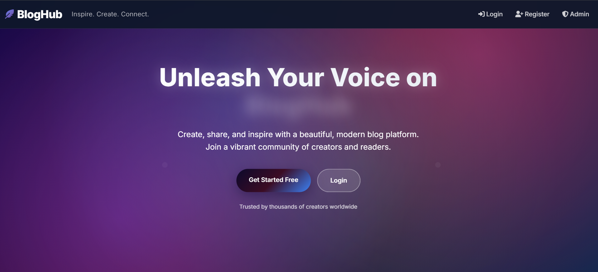

# 📝 Blog Website — BlogHub  

A modern blogging platform built with **ASP.NET Core (.NET 9.0)** and **Entity Framework Core**.  
Users can create posts, like, comment, and bookmark blogs. Admins can manage content, users, and notifications.  

---

## ✨ Features  
- ✍️ Create, edit, delete posts (with image & video upload)  
- 💬 Comments & threaded replies  
- 👍 Likes & 🔖 bookmarks  
- 🔍 Search + sort (newest, likes, comments)  
- 👥 User roles: **Reader, Creator, Admin**  
- 🔔 Notifications for creators & admins  
- 🎨 Responsive UI with **Dark/Light mode**  
- 📱 Mobile-friendly layout  

---

## 📸 Screenshots  

### 🏠 Home Page  
  

### 📄 Post Detail  
  

---

## 🚀 Getting Started  

### 1️⃣ Prerequisites  
Make sure you have installed:  
- [.NET 9.0 SDK](https://dotnet.microsoft.com/download)  
- [SQL Server LocalDB](https://learn.microsoft.com/en-us/sql/database-engine/configure-windows/sql-server-express-localdb)  
- [Git](https://git-scm.com/)  

---

### 2️⃣ Clone the Repository  

git clone https://github.com/YOUR_USERNAME/Blog-Website-BlogHub-.git
cd Blog-Website-BlogHub-
Open BlogApp.sln in Visual Studio 2022+ (or JetBrains Rider / VS Code with C# extension).
Make sure the startup project is set to blogapp

---

### 3️⃣ Configure the Database

Open appsettings.json

Update the connection string with your own SQL Server / LocalDB instance:
"ConnectionStrings": {
  "DefaultConnection": "Server=(localdb)\\MSSQLLocalDB;Database=MyBlogDBase;Trusted_Connection=True;MultipleActiveResultSets=true;TrustServerCertificate=true;"
}

---

4️⃣ Setup Admin Account

In Program.cs, update the default Admin user details (email, username, and password) before running for the first time.
// Inside Program.cs or your seed method
var adminEmail = "admin@bloghub.com";
var adminPassword = "Admin@123";
var adminName = "Super Admin";

---

5️⃣ Apply Migrations

Open the terminal in the project folder and run:
dotnet ef database update

---
6️⃣ Run the Project

Press F5 in Visual Studio OR run:
dotnet run

---

7️⃣ Access in Browser

Go to:
https://localhost:5001

✅ The app should now be running locally. You can register new users, log in as the admin, and start blogging!

---
'

🔧 Modify as You Wish
Update connection string in appsettings.json for your DB setup
Change admin credentials in Program.cs
Customize UI, features, or add new modules

---

👨‍💻 Author: Built with ❤️ by Suman
